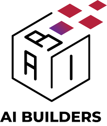

   
  
   

<h3 align="center">
  
a program for kids who want to build good AI

</h3>

AI Builders เป็นโครงการสำหรับน้องๆมัธยมต้น-ปลาย ที่สนใจสร้างผลงานโดยใช้เทคนิคทางด้านวิทยาศาสตร์ข้อมูล (Data Science)
และปัญญาประดิษฐ์ (Artificial Intelligence)

โครงการ AI Builders ก่อตั้งขึ้นจากความร่วมมือระหว่าง VISTEC / AI Research และ Central Tech
เพื่อพัฒนาองค์ความรู้ทางด้านวิทยาศาสตร์ข้อมูล (Data Science) และปัญญาประดิษฐ์ (Artificial Intelligence / AI)
ให้กับน้องๆระดับมัธยมต้น-ปลาย ที่สนใจอยากเรียนรู้และพัฒนาโครงงานที่ใช้ทักษะในด้านนี้เพื่อประยุกต์ใช้จริงในชีวิตประจำวัน

Website: [https://ai-builders.github.io/](https://ai-builders.github.io/)
Facebook: [aibuildersx](https://www.facebook.com/aibuildersx)
